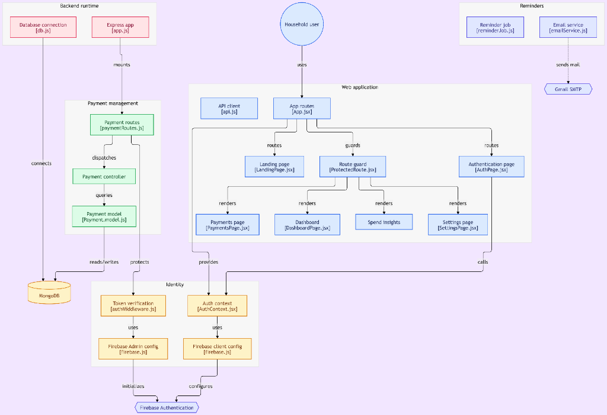

# Remetra — Smart Bill Reminders & Spend Insights ⚡

[](https://reactjs.org/)
[](https://vitejs.dev/)
[](https://tailwindcss.com/)
[](https://expressjs.com/)
[](https://www.mongodb.com/)
[](https://firebase.google.com/)
[](LICENSE)

**Remetra** is a modern, full-stack household vault application designed to track recurring bills, subscriptions, and mobile recharges, automate email reminder notifications, and provide clear analytics on household spend distribution.

---

## 🌟 Key Features

- 📱 **Mobile Recharge Expiry Tracking**: Dedicated tracking for **Prepaid** (validity days & mobile number) and **Postpaid** bill due dates.
- ⚡ **Utility & Electricity Bills**: Track Consumer IDs, utility providers, and payment due dates.
- 🎬 **Recurring Subscriptions**: Track monthly or yearly streaming, cloud, and software memberships.
- ⏰ **Automated Email Reminders**: `node-cron` background task runs automatically to send email reminders 3 days before any due date via Gmail SMTP.
- 📊 **Spend Insights & Analytics**: Visual donut charts for category breakdowns, top spender analytics, and cycle run-rate meters.
- 🔐 **Firebase Identity & Security**: Secure user registration, password resets, and verified JWT Bearer tokens on every API request.
- 🎨 **Stitch FinTech Vault Design**: Dark slate aesthetic with glassmorphic cards, custom micro-interactions, and 100% responsive mobile layout (down to 320px screens).

---

## 🏗️ System Architecture



<details>
<summary>Click to view interactive Mermaid diagram</summary>


</details>

---

## 🛠️ Technology Stack

### Frontend
- **Framework**: React 18 + Vite
- **Styling**: Tailwind CSS + Custom CSS Variables (Glassmorphic Vault Theme)
- **Icons & Typography**: Google Fonts (Inter, Outfit, Roboto) + Material Symbols Outlined
- **Routing**: React Router DOM v6
- **Authentication**: Firebase Web SDK (`firebase/auth`)
- **HTTP Client**: Axios

### Backend
- **Runtime**: Node.js (ES Modules)
- **Framework**: Express.js
- **Database**: MongoDB Atlas via Mongoose ORM
- **Identity Verification**: Firebase Admin SDK (`firebase-admin`)
- **Rate Limiting & Abuse Prevention**: `express-rate-limit` (Tiered route-level limiters)
- **Background Jobs**: `node-cron`
- **Email Delivery**: Resend API & Nodemailer (Transaction emails & OTPs)

---

## 📂 Project Structure

```
Remetra/
├── Backend/
│   ├── app.js                   # Express app configuration & middleware
│   ├── index.js                 # Server entry point & DB connection
│   └── src/
│       ├── config/
│       │   ├── db.js            # MongoDB Mongoose connection
│       │   └── firebase.js      # Firebase Admin SDK initialization
│       ├── controllers/
│       │   ├── authController.js    # Registration OTP & token verification
│       │   ├── contactController.js # Support/grievance contact submissions
│       │   └── paymentController.js # Payments CRUD & Cashfree gateway logic
│       ├── jobs/
│       │   └── reminderJob.js   # Automated email reminder cron job
│       ├── middlewares/
│       │   ├── authMiddleware.js # Bearer Token authentication guard
│       │   ├── errorHandler.js   # Global error handling
│       │   └── rateLimiter.js    # Tiered route-level rate limiters
│       ├── models/
│       │   ├── EmailVerification.js # Registration OTP/token schema
│       │   └── Payment.model.js  # Mongoose Payment schema
│       ├── routes/
│       │   ├── authRoutes.js     # OTP & verification routes
│       │   ├── contactRoutes.js  # Public contact inquiry routes
│       │   └── paymentRoutes.js  # Express payment & Cashfree routes
│       └── services/
│           └── emailService.js   # Resend API & email templates
└── Frontend/
    ├── index.html
    ├── vercel.json              # Vercel SPA rewrite routing rules
    └── src/
        ├── App.jsx              # Main router setup
        ├── components/          # Reusable UI components & drawers
        ├── context/             # AuthContext provider
        ├── pages/               # Dashboard, Payments, Insights, Settings
        └── services/            # Axios API layer
```

---

## 🔌 API Endpoints Summary

All protected endpoints require an `Authorization: Bearer <Firebase_Token>` header.

| Method | Endpoint | Auth | Rate Limit Tier | Description |
| :--- | :--- | :---: | :---: | :--- |
| `GET` | `/` | Public | None | Root API health status (unthrottled for cloud probes) |
| `GET` | `/health` | Public | None | Healthcheck endpoint for Render / Uptime monitoring |
| `POST` | `/api/auth/send-registration-otp` | Public | 10 req / 15m (IP) | Generate and dispatch 6-digit registration OTP via Resend |
| `POST` | `/api/auth/verify-registration-otp` | Public | 10 req / 15m (IP) | Verify registration OTP with 5-attempt brute-force protection |
| `POST` | `/api/auth/verify-email-token` | Public | 30 req / 15m (IP) | Verify temporary email verification proof token |
| `POST` | `/api/auth/confirm-email-verification` | Bearer | 30 req / 15m (IP) | Confirm email verification status on Firebase user record |
| `POST` | `/api/contact` | Public | 5 req / 15m (IP) | Submit validated contact/support inquiry |
| `GET` | `/api/payments` | Bearer | 60 req / 1m (UID) | Retrieve all payments for the authenticated user |
| `GET` | `/api/payments/:id` | Bearer | 60 req / 1m (UID) | Get single payment details by ID |
| `POST` | `/api/payments` | Bearer | 60 req / 1m (UID) | Create a new payment commitment |
| `PUT` | `/api/payments/:id` | Bearer | 60 req / 1m (UID) | Update an existing payment record |
| `DELETE` | `/api/payments/:id` | Bearer | 60 req / 1m (UID) | Delete a single payment record |
| `DELETE` | `/api/payments/account` | Bearer | 5 req / 15m (UID) | Delete user account and cascade purge payments |
| `POST` | `/api/payments/:id/pay` | Bearer | 15 req / 1m (UID) | Create Cashfree Sandbox order and return session ID |
| `GET` | `/api/payments/:id/verify-payment` | Bearer | 15 req / 1m (UID) | Actively verify payment status with Cashfree API |
| `POST` | `/api/payments/:id/verify-payment` | Bearer | 15 req / 1m (UID) | POST variant for active payment status reconciliation |
| `POST` | `/api/payments/webhook` | Public | 300 req / 5m (IP) | Cashfree server webhook listener (HMAC-SHA256 verified) |

---

## 🛡️ Security Architecture & Rate-Limiting Policy

Remetra enforces a layered defense-in-depth security model using `express-rate-limit` (v8) with tiered route-level middleware to protect server resources, MongoDB connections, and third-party API quotas:

### Rate-Limiting Tiers
1. **Global Baseline Limiter (`globalLimiter`)**:
   - **Limit**: `300 requests / 15 minutes / IP`.
   - Applied globally in `app.js` across all API routers. Provides defense against broad volumetric floods.
   - Root `/` and `/health` routes remain **unthrottled** so cloud container orchestrators and monitoring probes (e.g. Render, UptimeRobot) are never prematurely blocked.
2. **Authentication & OTP Limiter (`authOtpLimiter`)**:
   - **Limit**: `10 requests / 15 minutes / IP`.
   - Protects `/send-registration-otp` and `/verify-registration-otp`. Complements application-level protections (60s resend cooldown, 5-attempt limit, 10-minute expiry) to prevent OTP bombing.
3. **Token Verification Limiter (`tokenVerificationLimiter`)**:
   - **Limit**: `30 requests / 15 minutes / IP`.
   - Protects `/verify-email-token` and `/confirm-email-verification` from rapid-fire token enumeration.
4. **Payment Gateway Limiter (`paymentGatewayLimiter`)**:
   - **Limit**: `15 requests / 1 minute / authenticated user (`req.user.uid`)` (falls back to IP).
   - Protects `POST /:id/pay` and `GET|POST /:id/verify-payment`. Prevents gateway quota exhaustion and order collision while allowing normal checkout retries.
5. **Payment CRUD Limiter (`paymentCrudLimiter`)**:
   - **Limit**: `60 requests / 1 minute / authenticated user (`req.user.uid`)` (falls back to IP).
   - Protects payment creation, retrieval, updates, and deletion. Sized generously so active dashboard usage is smooth and uninhibited.
6. **Account Deletion Limiter (`accountDeletionLimiter`)**:
   - **Limit**: `5 requests / 15 minutes / authenticated user (`req.user.uid`)`.
   - Restricts repetitive invocation of heavy cascade deletion operations.
7. **Cashfree Webhook Limiter (`webhookLimiter`)**:
   - **Limit**: `300 requests / 5 minutes / IP`.
   - **Authentication**: Public endpoint — Firebase Auth is **intentionally NOT used** because requests originate server-to-server from Cashfree. Authenticated solely via cryptographic HMAC-SHA256 signature verification (`x-webhook-signature`, `x-webhook-timestamp`, `req.rawBody`).
   - Sized for high-capacity burst absorption to ensure legitimate webhook events dispatched simultaneously by Cashfree are never dropped.
8. **Contact Form Limiter (`contactLimiter`)**:
   - **Limit**: `5 requests / 15 minutes / IP`.
   - Protects `POST /api/contact` against automated spam and email dispatch abuse.

> [!NOTE]
> **Business Logic Unaffected**: The rate-limiting layer functions strictly as a network and router gatekeeper. Cashfree order creation, signature verification, payment verification, and webhook reconciliation business logic remain completely unchanged.

> [!IMPORTANT]
> **Process-Local Storage**: Rate limiters currently utilize an in-memory, process-local store (`MemoryStore`). Limits are tracked per Node.js process instance and are not shared across distributed multi-instance clusters. If horizontal multi-instance scaling is introduced in the future, a shared store (such as Redis) can be plugged into `express-rate-limit`.

### Reverse-Proxy & Anti-Spoofing Configuration (`TRUST_PROXY`)
When deployed behind reverse proxies such as **Render**, Express must derive the client's true IP rather than the proxy's internal address:
- In `app.js`, Express is configured with `app.set("trust proxy", 1)`.
- Configuring trust for exactly **1 hop** tells Express to trust Render's immediate reverse proxy and inspect the connecting IP from the right side of `X-Forwarded-For`.
- This prevents attackers from spoofing client IPs by sending forged `X-Forwarded-For` headers, guaranteeing that rate-limit counters cannot be bypassed through header manipulation.

---

## 💳 Cashfree Sandbox Payment Gateway

Remetra integrates with the **Cashfree Payment Gateway Sandbox** to enable simulated in-app digital bill settlements with automated verification and webhook reconciliation.

### Payment Architecture & Flow
```
Remetra Frontend (React)
      ↓ (1. User clicks "Pay Now")
POST /api/payments/:id/pay (with Firebase JWT)
      ↓ (2. Authenticated Order Request)
Remetra Express Backend
      ↓ (3. PGCreateOrder via Cashfree SDK)
      ↓ (4. Persist cashfreeOrderId & cashfreeOrders array in MongoDB)
Cashfree Sandbox API
      ↓ (5. Returns payment_session_id)
Remetra Frontend (Cashfree JS SDK)
      ↓ (6. cashfree.checkout({ redirectTarget: "_modal" }))
Cashfree Web Checkout Popup
      ↓ (7. User completes sandbox payment in modal)
Checkout Closes
      ↓ (8. Dual Reconciliation Paths)
   ┌───────────────────────────────────────────┐
   │                                           │
   ▼ (Path A: Synchronous Verification)         ▼ (Path B: Asynchronous Webhook)
Frontend calls GET /:id/verify-payment      Cashfree calls POST /api/payments/webhook
   │                                           │
   │ (Firebase Bearer Token validated)         │ (Raw body HMAC-SHA256 verified)
   ▼                                           ▼
Remetra Backend queries Cashfree API        Remetra Backend unpacks PAYMENT_SUCCESS
   │                                           │
   ▼                                           ▼
Validates Amount & Currency (INR)           Validates mapped order ID & amount
   │                                           │
   └─────────────────────┬─────────────────────┘
                         │
                         ▼
             MongoDB Payment Document
           status = "Paid", paidDate = now
                         │
                         ▼
               Frontend Auto-Refresh
```

### Key Security & Architecture Principles
- **Backend-Only Secrets**: `CASHFREE_SECRET_KEY` remains strictly on the Express backend server and is **never** shared with or bundled into the Vite frontend.
- **Client Session Token**: The frontend only receives the temporary `payment_session_id` required by `@cashfreepayments/cashfree-js` to render the checkout popup.
- **Persistent Order Mapping & Retry Safety**: Every payment attempt generates a unique `order_<paymentId>_<timestamp>` which is persisted to `cashfreeOrderId` as well as an audit array `cashfreeOrders` in MongoDB.
- **No Client-Side Status Trust**: Closing or completing the frontend checkout does **not** directly mark MongoDB payments as "Paid". Full settlement reconciliation requires backend Cashfree verification or webhook.
- **Raw Body HMAC-SHA256 Webhook Verification**: `POST /api/payments/webhook` verifies `x-webhook-signature` using the raw unparsed request buffer, timestamp, and client secret via official Cashfree SDK.
- **Strict Idempotency**: Repeated webhooks or verification calls safely verify existing `Paid` status without creating duplicate payments or corrupting `paidDate`.
- **Preserved Offline Settlements**: Manual "Mark Paid" functionality remains available for external cash or banking transactions.

### Implementation Status
- ✅ **COMPLETED**: Backend Cashfree Sandbox Order Creation (`POST /api/payments/:id/pay`)
- ✅ **COMPLETED**: Persistent Order ID Mapping (`cashfreeOrderId`, `cashfreeOrders`)
- ✅ **COMPLETED**: Frontend Cashfree JS SDK Modal Checkout Integration (`@cashfreepayments/cashfree-js`)
- ✅ **COMPLETED**: "Pay Now" actions across Payments Table, Mobile Cards, and Payment Details Modal
- ✅ **COMPLETED**: Backend Payment Verification Endpoint (`GET /api/payments/:id/verify-payment`)
- ✅ **COMPLETED**: Cashfree Webhook Handler with HMAC-SHA256 verification (`POST /api/payments/webhook`)
- ✅ **COMPLETED**: Frontend post-checkout verification trigger and automatic state refresh

---

## 🚀 Environment Setup & Installation

### 1. Prerequisites
- Node.js (v18+)
- MongoDB Atlas cluster URL
- Firebase Project with Email/Password Auth enabled
- Cashfree Merchant Sandbox Account (for App ID & Secret Key)
- Resend API Key (for transactional email reminders and OTP verification)

### 2. Backend Environment Variables (`Backend/.env`)
```env
PORT=5000
MONGO_URI=mongodb+srv://<username>:<password>@cluster.mongodb.net/remetra
FIREBASE_SERVICE_ACCOUNT_PATH=./src/config/serviceAccountKey.json
RESEND_API_KEY=re_your_resend_api_key
TRUST_PROXY=1 # 1 hop for Render / reverse proxy client IP detection

# Cashfree Sandbox Credentials (Backend-Only)
CASHFREE_APP_ID=your_cashfree_sandbox_app_id
CASHFREE_SECRET_KEY=your_cashfree_sandbox_secret_key
CLIENT_URL=http://localhost:5173
```

### 3. Frontend Environment Variables (`Frontend/.env`)
```env
VITE_API_BASE_URL=http://localhost:5000
VITE_FIREBASE_API_KEY=your-firebase-api-key
VITE_FIREBASE_AUTH_DOMAIN=remetra.firebaseapp.com
VITE_FIREBASE_PROJECT_ID=remetra
VITE_FIREBASE_STORAGE_BUCKET=remetra.appspot.com
VITE_FIREBASE_MESSAGING_SENDER_ID=your-sender-id
VITE_FIREBASE_APP_ID=your-app-id
```

### 4. Running Locally

#### Run Backend Server:
```bash
cd Backend
npm install
npm run dev
```

#### Run Frontend Web App:
```bash
cd Frontend
npm install
npm run dev
```

Open [http://localhost:5173](http://localhost:5173) in your browser.

---

## 📄 License

Distributed under the MIT License. See `LICENSE` for details.
