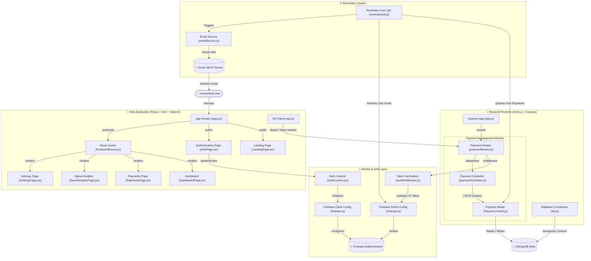

# Remetra — Smart Bill Reminders & Spend Insights ⚡

[](https://reactjs.org/)
[](https://vitejs.dev/)
[](https://tailwindcss.com/)
[](https://expressjs.com/)
[](https://www.mongodb.com/)
[](https://firebase.google.com/)
[](LICENSE)

**Remetra** is a modern, full-stack household vault application designed to track recurring bills, subscriptions, and mobile recharges, automate email reminder notifications, and provide clear analytics on household spend distribution.

---

## 🌟 Key Features

- 📱 **Mobile Recharge Expiry Tracking**: Dedicated tracking for **Prepaid** (validity days & mobile number) and **Postpaid** bill due dates.
- ⚡ **Utility & Electricity Bills**: Track Consumer IDs, utility providers, and payment due dates.
- 🎬 **Recurring Subscriptions**: Track monthly or yearly streaming, cloud, and software memberships.
- ⏰ **Automated Email Reminders**: `node-cron` background task runs automatically to send email reminders 3 days before any due date via Gmail SMTP.
- 📊 **Spend Insights & Analytics**: Visual donut charts for category breakdowns, top spender analytics, and cycle run-rate meters.
- 🔐 **Firebase Identity & Security**: Secure user registration, password resets, and verified JWT Bearer tokens on every API request.
- 🎨 **Stitch FinTech Vault Design**: Dark slate aesthetic with glassmorphic cards, custom micro-interactions, and 100% responsive mobile layout (down to 320px screens).

---

## 🏗️ System Architecture


<details>
<summary>Click to view interactive Mermaid diagram</summary>


</details>

---

## 🛠️ Technology Stack

### Frontend
- **Framework**: React 18 + Vite
- **Styling**: Tailwind CSS + Custom CSS Variables (Glassmorphic Vault Theme)
- **Icons & Typography**: Google Fonts (Inter, Outfit, Roboto) + Material Symbols Outlined
- **Routing**: React Router DOM v6
- **Authentication**: Firebase Web SDK (`firebase/auth`)
- **HTTP Client**: Axios

### Backend
- **Runtime**: Node.js (ES Modules)
- **Framework**: Express.js
- **Database**: MongoDB Atlas via Mongoose ORM
- **Identity Verification**: Firebase Admin SDK (`firebase-admin`)
- **Background Jobs**: `node-cron`
- **Email Delivery**: Nodemailer (Gmail SMTP)

---

## 📂 Project Structure

```
Remetra/
├── Backend/
│   ├── app.js                   # Express app configuration & middleware
│   ├── index.js                 # Server entry point & DB connection
│   └── src/
│       ├── config/
│       │   ├── db.js            # MongoDB Mongoose connection
│       │   └── firebase.js      # Firebase Admin SDK initialization
│       ├── controllers/
│       │   └── paymentController.js # Payments CRUD logic
│       ├── jobs/
│       │   └── reminderJob.js   # Automated email reminder cron job
│       ├── middlewares/
│       │   ├── authMiddleware.js # Bearer Token authentication guard
│       │   └── errorHandler.js   # Global error handling
│       ├── models/
│       │   └── Payment.model.js  # Mongoose Payment schema
│       ├── routes/
│       │   └── paymentRoutes.js  # Express payment routes
│       └── services/
│           └── emailService.js   # Nodemailer email transporter
└── Frontend/
    ├── index.html
    ├── vercel.json              # Vercel SPA rewrite routing rules
    └── src/
        ├── App.jsx              # Main router setup
        ├── components/          # Reusable UI components & drawers
        ├── context/             # AuthContext provider
        ├── pages/               # Dashboard, Payments, Insights, Settings
        └── services/            # Axios API layer
```

---

## 🔌 API Endpoints Summary

All `/api/payments` endpoints require an `Authorization: Bearer <Firebase_Token>` header.

| Method | Endpoint | Description |
| :--- | :--- | :--- |
| `GET` | `/` | API Status |
| `GET` | `/health` | Healthcheck endpoint for UptimeRobot monitoring |
| `GET` | `/api/payments` | Retrieve all payments for the authenticated user |
| `GET` | `/api/payments/:id` | Get single payment details by ID |
| `POST` | `/api/payments` | Create a new payment commitment |
| `PUT` | `/api/payments/:id` | Update an existing payment |
| `DELETE` | `/api/payments/:id` | Delete a payment record |

---

## 🚀 Environment Setup & Installation

### 1. Prerequisites
- Node.js (v18+)
- MongoDB Atlas cluster URL
- Firebase Project with Email/Password Auth enabled
- Gmail Account with App Password (for email reminders)

### 2. Backend Environment Variables (`Backend/.env`)
```env
PORT=5000
MONGO_URI=mongodb+srv://<username>:<password>@cluster.mongodb.net/remetra
FIREBASE_SERVICE_ACCOUNT_PATH=./src/config/serviceAccountKey.json
EMAIL_USER=your-email@gmail.com
EMAIL_PASS=your-gmail-app-password
```

### 3. Frontend Environment Variables (`Frontend/.env`)
```env
VITE_API_BASE_URL=http://localhost:5000
VITE_FIREBASE_API_KEY=your-firebase-api-key
VITE_FIREBASE_AUTH_DOMAIN=remetra.firebaseapp.com
VITE_FIREBASE_PROJECT_ID=remetra
VITE_FIREBASE_STORAGE_BUCKET=remetra.appspot.com
VITE_FIREBASE_MESSAGING_SENDER_ID=your-sender-id
VITE_FIREBASE_APP_ID=your-app-id
```

### 4. Running Locally

#### Run Backend Server:
```bash
cd Backend
npm install
npm run dev
```

#### Run Frontend Web App:
```bash
cd Frontend
npm install
npm run dev
```

Open [http://localhost:5173](http://localhost:5173) in your browser.

---

## 📄 License

Distributed under the MIT License. See `LICENSE` for details.
