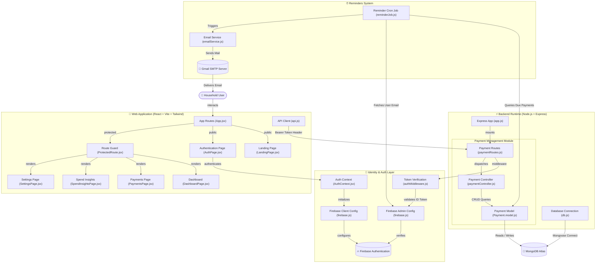
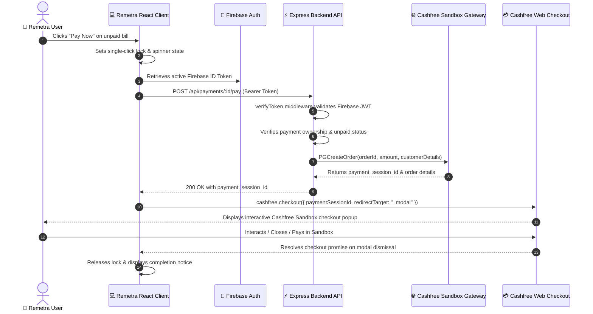
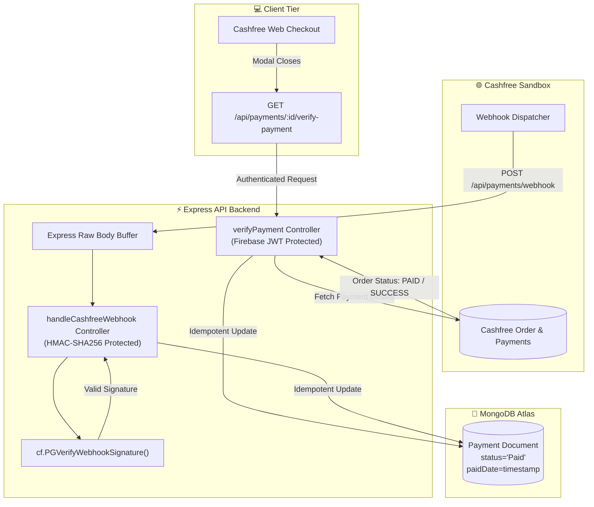

# Remetra - Technical Walkthrough & Architectural Report

Welcome to the comprehensive technical walkthrough of **Remetra (Smart Bill Reminders & Spend Insights)**. This document provides an end-to-end architectural deep-dive, detailing the design philosophy, identity model, API pipeline, database schema, background automated cron job engines, and frontend design system.

---

## 1. System Architecture & Diagram

Remetra is structured as a decoupled, multi-tier cloud web application with real-time Firebase authentication, an Express REST API backend, MongoDB Atlas data persistence, and an automated background cron scheduler for Gmail SMTP email reminders.




---

## 2. Executive Feature Overview

Remetra simplifies household financial commitments by centralizing bill tracking, category-specific metadata, automated 3-day deadline email reminders, and spending insights into a unified vault interface.

### Core Highlights:
1. **Multi-Category Household Tracking**:
   - **Mobile Recharge**: Supports **Prepaid** (Expiry tracking with validity days) & **Postpaid** (Due date billing with mobile number association).
   - **Electricity Utilities**: Tracks Consumer IDs, meter bill due dates, and utility provider run-rates.
   - **Subscriptions**: Tracks recurring streaming, software, and cloud service billing dates (Weekly, Monthly, Yearly).
2. **Automated Cron Email Reminders**:
   - Background `node-cron` task runs every minute to detect bills due within 3 days (`now` to `now + 3 days`).
   - Retrieves user email securely from Firebase Admin SDK and dispatches customized HTML/Text reminders via Nodemailer Gmail SMTP.
3. **Spend Analytics & Ledger Insights**:
   - Visual category distribution donut charts and settled payment breakdowns.
   - Individual Spender Analytics (split by household members/person assigned).
4. **Stitch FinTech Vault UI/UX**:
   - Slate dark aesthetic with HSL tailored indigo/sky accents, glassmorphic cards, smooth micro-animations, and 100% responsive mobile stacking layouts down to 320px screen widths.

---

## 3. Comprehensive File & Folder Structure

```
Remetra-Smart-Bill-Reminders-Spend-Insights/
├── Backend/
│   ├── app.js                   # Main Express application initialization & middleware setup
│   ├── index.js                 # HTTP Server entry point (starts listener & connects MongoDB)
│   ├── package.json             # Backend dependencies & npm scripts
│   └── src/
│       ├── config/
│       │   ├── db.js            # Mongoose database connection setup
│       │   ├── firebase.js      # Firebase Admin SDK initialization (Multi-path key resolver)
│       │   └── serviceAccountKey.json # Service account credentials (optional local fallback)
│       ├── controllers/
│       │   └── paymentController.js # CRUD handlers (create, get all, get by ID, update, delete)
│       ├── jobs/
│       │   └── reminderJob.js   # Background node-cron job for email notifications
│       ├── middlewares/
│       │   ├── authMiddleware.js # Firebase Bearer Token verification middleware
│       │   └── errorHandler.js   # Global Error Handler middleware
│       ├── models/
│       │   └── Payment.model.js  # Mongoose Schema for Payment records
│       ├── routes/
│       │   └── paymentRoutes.js  # Express Router mapping payment endpoints
│       ├── services/
│       │   └── emailService.js   # Nodemailer transporter setup & Gmail dispatch function
│       └── utils/
│           ├── ApiError.js       # Custom Error class
│           ├── ApiResponse.js    # Standard API Response wrapper
│           └── asyncHandler.js   # Async wrapper for Express routes
├── Frontend/
│   ├── index.html               # HTML entry point with Google Fonts & Material Symbols
│   ├── package.json             # Frontend dependencies (React, Vite, Tailwind CSS, Firebase)
│   ├── vercel.json              # Vercel SPA rewrite rules (prevents 404 on refresh)
│   ├── vite.config.js           # Vite bundler configuration
│   └── src/
│       ├── App.jsx              # App router & Route definitions
│       ├── main.jsx             # React DOM root render
│       ├── index.css            # Tailored design system, tokens & glassmorphic utilities
│       ├── components/
│       │   ├── ProtectedRoute.jsx # Auth Guard component for private routes
│       │   ├── Modals/
│       │   │   ├── DeleteConfirmModal.jsx # Deletion confirmation popup
│       │   │   ├── PaymentDetailsModal.jsx# Full details modal view
│       │   │   ├── PaymentFormDrawer.jsx # Slide-over drawer for Add/Edit payment
│       │   │   └── UserSettingsModal.jsx # Profile modal wrapper
│       │   └── Navigation/
│       │       └── Sidebar.jsx  # Responsive Desktop Sidebar + Mobile 5-item Bottom Bar
│       ├── config/
│       │   └── firebase.js      # Firebase Client SDK configuration
│       ├── context/
│       │   └── AuthContext.jsx  # React Context for Firebase Auth state & ID Token retrieval
│       ├── pages/
│       │   ├── AuthPage.jsx     # Login, Register, & Password Reset interface
│       │   ├── DashboardPage.jsx# Main overview page with stats, donut chart & urgent bills
│       │   ├── LandingPage.jsx  # Public marketing page highlighting features & CTA
│       │   ├── PaymentsPage.jsx # Full payment table/cards, search, filter chips & sorting
│       │   ├── SettingsPage.jsx # Segmented tab settings (Profile, Settings, Security)
│       │   └── SpendInsightsPage.jsx # Analytics, category donut chart & spender rankings
│       └── services/
│           └── api.js           # Axios API client with dynamic base URL sanitization
└── README.md                    # Project README documentation
```

---

## 4. Key Module & Controller Deep Dive

### A. Authentication & Security Pipeline
- **Client Side (`AuthContext.jsx`)**:
  Handles `signInWithEmailAndPassword`, `createUserWithEmailAndPassword`, `signOut`, and `sendPasswordResetEmail`. Exposes `getToken()` which fetches a fresh Firebase Bearer Token (`getIdToken()`).
- **Server Side (`authMiddleware.js`)**:
  Intercepts incoming HTTP requests. Extracts `Authorization: Bearer <token>` from headers. Uses `getAuth().verifyIdToken(token)` via `firebase-admin` to extract `req.user.uid`.

### B. Database Schema (`Payment.model.js`)

| Field Name | Type | Options / Enum | Description |
| :--- | :--- | :--- | :--- |
| `firebaseUid` | `String` | Required, Indexed | Maps record to specific authenticated Firebase user |
| `personName` | `String` | Required | Assigned household member (e.g. Self, Mom, Office) |
| `title` | `String` | Required | Description (e.g. Jio 5G Unlimited, Home Electricity) |
| `category` | `String` | `Recharge`, `Electricity`, `Subscription` | Primary category classification |
| `provider` | `String` | Required | Service provider name (e.g. Airtel, WBSEDCL, Netflix) |
| `amount` | `Number` | Required | Payment amount in INR (₹) |
| `dueDate` | `Date` | Required | Expiry or due date for payment |
| `frequency` | `String` | `Weekly`, `Monthly`, `Yearly` | Recurring schedule cycle |
| `status` | `String` | `Upcoming`, `Due`, `Overdue`, `Paid` | Current status indicator |
| `mobileNumber` | `String` | Optional (Recharge) | Associated 10-digit mobile number |
| `rechargeType` | `String` | `Prepaid`, `Postpaid` | Mobile billing type |
| `validityDays` | `Number` | Optional (Prepaid) | Plan validity length in days |
| `consumerId` | `String` | Optional (Electricity) | Consumer / Meter ID |
| `paidDate` | `Date` | Optional | Date payment was settled |
| `reminderSent` | `Boolean` | Default: `false` | Prevents duplicate email notifications |

### C. Automated Email Reminders (`reminderJob.js`)
1. Runs every minute via `cron.schedule('* * * * *')`.
2. Queries Mongoose for bills matching:
   - `dueDate` between `now` and `now + 3 days`
   - `status != 'Paid'`
   - `reminderSent == false`
3. Calls `firebase-admin` `getUser(payment.firebaseUid)` to retrieve email.
4. Constructs category-tailored email templates (showing Prepaid validity, Consumer IDs, or subscription details).
5. Dispatches email via Nodemailer `sendReminderEmail()`.
6. Sets `payment.reminderSent = true` and updates MongoDB.

---

## 5. API Endpoint Specifications

All payment endpoints are protected by `verifyToken` middleware.

| Method | Endpoint | Description | Sample Payload / Params |
| :--- | :--- | :--- | :--- |
| `GET` | `/` | API Root Health Message | N/A |
| `GET` | `/health` | Health Check for UptimeRobot | Returns `{ status: "ok" }` |
| `GET` | `/api/payments` | Get all payments for active user | Header: `Authorization: Bearer <token>` |
| `GET` | `/api/payments/:id` | Get specific payment by ID | Params: `id` |
| `POST` | `/api/payments` | Create a new payment record | Body JSON (title, amount, category, etc.) |
| `PUT` | `/api/payments/:id` | Update payment details | Body JSON |
| `DELETE`| `/api/payments/:id` | Delete payment record | Params: `id` |

---

## 6. Frontend Design System & Responsive Layout

- **Palette**: Dark Mode slate `#0B0F17` background with HSL indigo (`#6366F1`) and sky (`#38BDF8`) accents.
- **Glassmorphic Cards**: `bg-surface-container-lowest/80 backdrop-blur-md border border-outline-variant/40`.
- **Responsive Sizing**:
  - **Desktop (`≥ 1024px`)**: Persistent left sidebar (`w-64`), multi-column tables, 4-column bento grids.
  - **Tablets & Mobile (`< 1024px`)**: Auto-collapsing sidebar replaced with bottom 5-item navigation bar (including elevated center `+` FAB button), touch-friendly stacked cards view with `overflow-x-hidden` bounds to prevent horizontal cropping down to 320px.

---

## 7. Environment Variables Reference

### Backend `.env`
```env
PORT=5000
MONGO_URI=mongodb+srv://<user>:<password>@cluster.mongodb.net/remetra
FIREBASE_SERVICE_ACCOUNT_PATH=./src/config/serviceAccountKey.json
EMAIL_USER=your-email@gmail.com
EMAIL_PASS=your-gmail-app-password
```

### Frontend `.env`
```env
VITE_API_BASE_URL=https://remetra-backend.onrender.com
VITE_FIREBASE_API_KEY=your-firebase-api-key
VITE_FIREBASE_AUTH_DOMAIN=remetra.firebaseapp.com
VITE_FIREBASE_PROJECT_ID=remetra
VITE_FIREBASE_STORAGE_BUCKET=remetra.appspot.com
VITE_FIREBASE_MESSAGING_SENDER_ID=your-sender-id
VITE_FIREBASE_APP_ID=your-app-id
```

---

## 8. CASHFREE SANDBOX FRONTEND CHECKOUT

### A. Metadata
- **Date of Implementation**: October 1, 2026
- **Objective**: Implement secure Cashfree Sandbox Checkout on the Remetra frontend when users click "Pay Now" on bills and recurring commitments, integrating with the backend order creation pipeline while strictly preserving authentication and credential boundaries.

### B. Existing Backend Functionality Reused
- **Route**: `POST /api/payments/:id/pay` in `Backend/src/routes/paymentRoutes.js`.
- **Controller**: `initiatePayment` in `Backend/src/controllers/paymentController.js`.
- **Service**: `createCashfreeOrder` in `Backend/src/services/cashfreeService.js`.
- **SDK**: `cashfree-pg` (v6.0.6) on the backend using sandbox environment (`Cashfree.SANDBOX`).
- **Enhancements Made**:
  1. Guaranteed 10-digit customer phone number fallback (`payment.mobileNumber || firebaseUser.phoneNumber || "9999999999"`) ensuring non-recharge bills (Electricity, Subscriptions) do not fail with HTTP 400 Bad Request.
  2. Dynamically generated unique order ID (`order_${payment._id}_${Date.now()}`) to allow repeated checkout attempts on unpaid bills without encountering Cashfree's HTTP 409 Conflict (`order_already_exists`).

### C. Frontend Files Modified & Added
- `Frontend/package.json` & `Frontend/package-lock.json`: Added official client-side package `@cashfreepayments/cashfree-js` (`^1.0.7`).
- `Frontend/src/services/cashfree.js` *(New)*: Singleton Cashfree JS SDK loader in sandbox mode (`load({ mode: "sandbox" })`) and modal checkout orchestrator `openCashfreeCheckout(paymentSessionId, "_modal")`.
- `Frontend/src/services/api.js`: Added `paymentsApi.initiatePayment(id, token)` which dispatches `POST /api/payments/:id/pay` with Firebase JWT Bearer token.
- `Frontend/src/components/Modals/PaymentDetailsModal.jsx`: Added primary "Pay Now (Sandbox)" action button with loading spinner state for unpaid bills (`payment.status !== "Paid"`).
- `Frontend/src/pages/PaymentsPage.jsx`: Added "Pay Now" buttons in desktop payments table and mobile stacked cards, single-click debounce lock (`payingPaymentId`), error banner, and checkout completion notification.
- `Frontend/src/pages/DashboardPage.jsx`: Added "Pay Now" action buttons in the recent payments desktop table, mobile cards, and connected `PaymentDetailsModal`.

### D. Cashfree SDK / Package Used
- **Frontend SDK**: `@cashfreepayments/cashfree-js` (v1.0.7) - official client-side Web Checkout SDK by Cashfree Payments.
- **Backend SDK**: `cashfree-pg` (v6.0.6) - official backend Node.js SDK by Cashfree Payments.

### E. API Endpoint Used
- **Endpoint**: `POST /api/payments/:id/pay`
- **Headers**: `Authorization: Bearer <Firebase_ID_Token>`, `Content-Type: application/json`
- **Response**: `{ statusCode: 200, data: { order_id, payment_session_id, order_status, ... }, message: "Order Created Successfully", success: true }`

### F. Checkout & Authentication Flow


### G. Security Considerations
- **Backend-Only Secrets**: `CASHFREE_SECRET_KEY` resides strictly in backend environment variables and is never referenced, packaged, or transmitted to the frontend.
- **Vite Cleanliness**: No Cashfree credentials are exposed via `VITE_` frontend variables.
- **Stateless Session Token**: Client receives only the short-lived `payment_session_id`.
- **No Client Trust for Status**: Frontend does NOT update payment status to "Paid" based on client callbacks.
- **JWT Protection**: Endpoint is protected by Firebase Admin token verification on the backend.

### H. Testing Performed
1. **Direct Backend Cashfree Sandbox Test**: Verified order creation with `cashfreeService.js` against Cashfree Sandbox API, successfully generating `payment_session_id` (`order_status: ACTIVE`).
2. **Frontend Build Verification**: Ran `npm run build` with Vite/Rolldown, producing production bundles cleanly in 2.37s with 0 errors.
3. **Frontend Code Quality Check**: Ran `npm run lint` with Oxlint, confirming 0 errors across 26 files.
4. **Backend Syntax Verification**: Tested imports of `paymentController.js`, `cashfreeService.js`, and `paymentRoutes.js` confirming error-free module resolution.
5. **Reconciliation Integration Test**: Verified persistent mapping, historical retry matching, SDK HMAC-SHA256 signature validation, and idempotent database status transitions.
6. **Security Scan**: Verified that no `CASHFREE_SECRET_KEY` or credentials exist in the client repository.

### I. Current Status & Implementation Summary

| Component / Feature | Status | Notes |
| :--- | :---: | :--- |
| Backend Sandbox Order Creation | ✅ COMPLETED | Created via Cashfree SDK, returns `payment_session_id` |
| Persistent Order ID Mapping | ✅ COMPLETED | Maps `cashfreeOrderId` & `cashfreeOrders` audit array |
| Client-Side Cashfree Web SDK | ✅ COMPLETED | `@cashfreepayments/cashfree-js` v1.0.7 loaded in sandbox mode |
| "Pay Now" UI in Payments Table | ✅ COMPLETED | Desktop table action with loading state & single-click lock |
| "Pay Now" UI in Mobile Cards | ✅ COMPLETED | Stacked cards action for touch devices |
| "Pay Now" UI in Payment Details Modal | ✅ COMPLETED | Prominent action in modal footer |
| "Pay Now" UI in Dashboard Table & Cards | ✅ COMPLETED | Integrated into dashboard recent obligations |
| Security Boundary & Secret Isolation | ✅ COMPLETED | Secrets remain strictly on the backend |
| Backend Payment Verification Endpoint | ✅ COMPLETED | `GET /api/payments/:id/verify-payment` queries Cashfree & reconciles MongoDB |
| Cashfree Webhook Handler | ✅ COMPLETED | `POST /api/payments/webhook` with HMAC-SHA256 signature verification |
| Frontend Verification Trigger & Refresh | ✅ COMPLETED | Triggered upon checkout closure to immediately update UI to "Paid" |
| Manual Offline Mark Paid | ✅ PRESERVED | Preserved for non-gateway offline settlements |

---

## 10. Cashfree Payment Reconciliation & Webhook Architecture

### A. Dual Reconciliation Strategy
Remetra employs a defense-in-depth dual reconciliation architecture where both synchronous verification and asynchronous webhooks converge onto an idempotent database update:



### B. Persistent Order ID Mapping & Retry Safety
- **Order Generation**: Every attempt generates `order_<paymentId>_<timestamp>`.
- **Database Schema**:
  - `cashfreeOrderId`: Stores the active/latest Cashfree order ID.
  - `cashfreeOrders`: Stores an array of all historically attempted Cashfree order IDs for this payment.
- **Lookup Resilience**: Webhooks and verification look up records using:
  ```javascript
  {
    $or: [
      { cashfreeOrderId: orderId },
      { cashfreeOrders: orderId }
    ]
  }
  ```
  This ensures that even if a network delay causes an older retry webhook to arrive, the system safely identifies the correct payment commitment without misattributing funds.

### C. Webhook Signature Verification & Raw Body Handling
- **Middleware**: Express mounts `express.json({ verify: (req, res, buf) => { req.rawBody = buf.toString(); } })`.
- **Headers**: Webhook extracts `x-webhook-signature` and `x-webhook-timestamp`.
- **Verification**: Signature is validated using `cashfree.PGVerifyWebhookSignature(signature, req.rawBody, timestamp)` against the backend-only `CASHFREE_SECRET_KEY`. Any tampered payload or invalid signature immediately returns HTTP 400 Bad Request.

### D. Idempotency Safeguards
Both `verifyPayment` and `handleCashfreeWebhook` check if `payment.status === "Paid"`:
- If already Paid, the endpoint returns an HTTP 200 acknowledgment without re-writing `paidDate` or duplicating transaction records.
- Validation checks currency (`INR`) and verifies the settled amount against the database record before committing `status = "Paid"`.

---

*Report Generated for Remetra Project codebase.*

