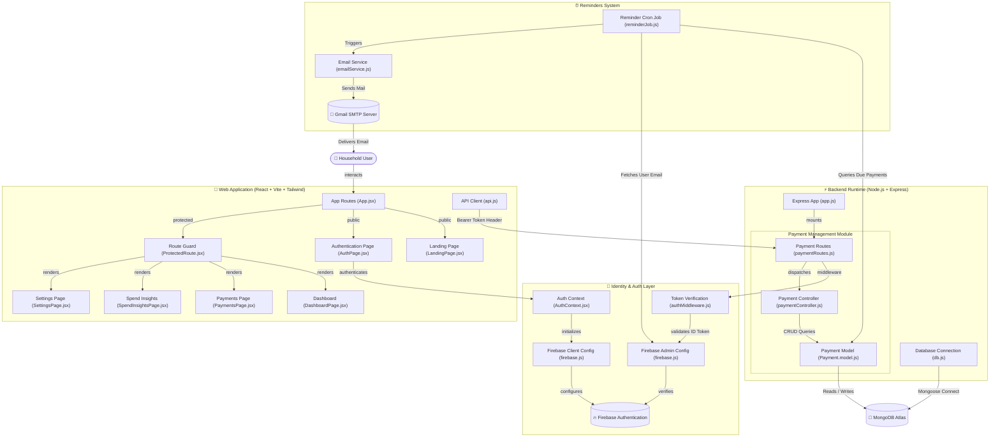

# Remetra - Technical Walkthrough & Architectural Report

Welcome to the comprehensive technical walkthrough of **Remetra (Smart Bill Reminders & Spend Insights)**. This document provides an end-to-end architectural deep-dive, detailing the design philosophy, identity model, API pipeline, database schema, background automated cron job engines, and frontend design system.

---

## 1. System Architecture & Diagram

Remetra is structured as a decoupled, multi-tier cloud web application with real-time Firebase authentication, an Express REST API backend, MongoDB Atlas data persistence, and an automated background cron scheduler for Gmail SMTP email reminders.




---

## 2. Executive Feature Overview

Remetra simplifies household financial commitments by centralizing bill tracking, category-specific metadata, automated 3-day deadline email reminders, and spending insights into a unified vault interface.

### Core Highlights:
1. **Multi-Category Household Tracking**:
   - **Mobile Recharge**: Supports **Prepaid** (Expiry tracking with validity days) & **Postpaid** (Due date billing with mobile number association).
   - **Electricity Utilities**: Tracks Consumer IDs, meter bill due dates, and utility provider run-rates.
   - **Subscriptions**: Tracks recurring streaming, software, and cloud service billing dates (Weekly, Monthly, Yearly).
2. **Automated Cron Email Reminders**:
   - Background `node-cron` task runs every minute to detect bills due within 3 days (`now` to `now + 3 days`).
   - Retrieves user email securely from Firebase Admin SDK and dispatches customized HTML/Text reminders via Nodemailer Gmail SMTP.
3. **Spend Analytics & Ledger Insights**:
   - Visual category distribution donut charts and settled payment breakdowns.
   - Individual Spender Analytics (split by household members/person assigned).
4. **Stitch FinTech Vault UI/UX**:
   - Slate dark aesthetic with HSL tailored indigo/sky accents, glassmorphic cards, smooth micro-animations, and 100% responsive mobile stacking layouts down to 320px screen widths.

---

## 3. Comprehensive File & Folder Structure

```
Remetra-Smart-Bill-Reminders-Spend-Insights/
├── Backend/
│   ├── app.js                   # Main Express application initialization & middleware setup
│   ├── index.js                 # HTTP Server entry point (starts listener & connects MongoDB)
│   ├── package.json             # Backend dependencies & npm scripts
│   └── src/
│       ├── config/
│       │   ├── db.js            # Mongoose database connection setup
│       │   ├── firebase.js      # Firebase Admin SDK initialization (Multi-path key resolver)
│       │   └── serviceAccountKey.json # Service account credentials (optional local fallback)
│       ├── controllers/
│       │   └── paymentController.js # CRUD handlers (create, get all, get by ID, update, delete)
│       ├── jobs/
│       │   └── reminderJob.js   # Background node-cron job for email notifications
│       ├── middlewares/
│       │   ├── authMiddleware.js # Firebase Bearer Token verification middleware
│       │   └── errorHandler.js   # Global Error Handler middleware
│       ├── models/
│       │   └── Payment.model.js  # Mongoose Schema for Payment records
│       ├── routes/
│       │   └── paymentRoutes.js  # Express Router mapping payment endpoints
│       ├── services/
│       │   └── emailService.js   # Nodemailer transporter setup & Gmail dispatch function
│       └── utils/
│           ├── ApiError.js       # Custom Error class
│           ├── ApiResponse.js    # Standard API Response wrapper
│           └── asyncHandler.js   # Async wrapper for Express routes
├── Frontend/
│   ├── index.html               # HTML entry point with Google Fonts & Material Symbols
│   ├── package.json             # Frontend dependencies (React, Vite, Tailwind CSS, Firebase)
│   ├── vercel.json              # Vercel SPA rewrite rules (prevents 404 on refresh)
│   ├── vite.config.js           # Vite bundler configuration
│   └── src/
│       ├── App.jsx              # App router & Route definitions
│       ├── main.jsx             # React DOM root render
│       ├── index.css            # Tailored design system, tokens & glassmorphic utilities
│       ├── components/
│       │   ├── ProtectedRoute.jsx # Auth Guard component for private routes
│       │   ├── Modals/
│       │   │   ├── DeleteConfirmModal.jsx # Deletion confirmation popup
│       │   │   ├── PaymentDetailsModal.jsx# Full details modal view
│       │   │   ├── PaymentFormDrawer.jsx # Slide-over drawer for Add/Edit payment
│       │   │   └── UserSettingsModal.jsx # Profile modal wrapper
│       │   └── Navigation/
│       │       └── Sidebar.jsx  # Responsive Desktop Sidebar + Mobile 5-item Bottom Bar
│       ├── config/
│       │   └── firebase.js      # Firebase Client SDK configuration
│       ├── context/
│       │   └── AuthContext.jsx  # React Context for Firebase Auth state & ID Token retrieval
│       ├── pages/
│       │   ├── AuthPage.jsx     # Login, Register, & Password Reset interface
│       │   ├── DashboardPage.jsx# Main overview page with stats, donut chart & urgent bills
│       │   ├── LandingPage.jsx  # Public marketing page highlighting features & CTA
│       │   ├── PaymentsPage.jsx # Full payment table/cards, search, filter chips & sorting
│       │   ├── SettingsPage.jsx # Segmented tab settings (Profile, Settings, Security)
│       │   └── SpendInsightsPage.jsx # Analytics, category donut chart & spender rankings
│       └── services/
│           └── api.js           # Axios API client with dynamic base URL sanitization
└── README.md                    # Project README documentation
```

---

## 4. Key Module & Controller Deep Dive

### A. Authentication & Security Pipeline
- **Client Side (`AuthContext.jsx`)**:
  Handles `signInWithEmailAndPassword`, `createUserWithEmailAndPassword`, `signOut`, and `sendPasswordResetEmail`. Exposes `getToken()` which fetches a fresh Firebase Bearer Token (`getIdToken()`).
- **Server Side (`authMiddleware.js`)**:
  Intercepts incoming HTTP requests. Extracts `Authorization: Bearer <token>` from headers. Uses `getAuth().verifyIdToken(token)` via `firebase-admin` to extract `req.user.uid`.

### B. Database Schema (`Payment.model.js`)

| Field Name | Type | Options / Enum | Description |
| :--- | :--- | :--- | :--- |
| `firebaseUid` | `String` | Required, Indexed | Maps record to specific authenticated Firebase user |
| `personName` | `String` | Required | Assigned household member (e.g. Self, Mom, Office) |
| `title` | `String` | Required | Description (e.g. Jio 5G Unlimited, Home Electricity) |
| `category` | `String` | `Recharge`, `Electricity`, `Subscription` | Primary category classification |
| `provider` | `String` | Required | Service provider name (e.g. Airtel, WBSEDCL, Netflix) |
| `amount` | `Number` | Required | Payment amount in INR (₹) |
| `dueDate` | `Date` | Required | Expiry or due date for payment |
| `frequency` | `String` | `Weekly`, `Monthly`, `Yearly` | Recurring schedule cycle |
| `status` | `String` | `Upcoming`, `Due`, `Overdue`, `Paid` | Current status indicator |
| `mobileNumber` | `String` | Optional (Recharge) | Associated 10-digit mobile number |
| `rechargeType` | `String` | `Prepaid`, `Postpaid` | Mobile billing type |
| `validityDays` | `Number` | Optional (Prepaid) | Plan validity length in days |
| `consumerId` | `String` | Optional (Electricity) | Consumer / Meter ID |
| `paidDate` | `Date` | Optional | Date payment was settled |
| `reminderSent` | `Boolean` | Default: `false` | Prevents duplicate email notifications |

### C. Automated Email Reminders (`reminderJob.js`)
1. Runs every minute via `cron.schedule('* * * * *')`.
2. Queries Mongoose for bills matching:
   - `dueDate` between `now` and `now + 3 days`
   - `status != 'Paid'`
   - `reminderSent == false`
3. Calls `firebase-admin` `getUser(payment.firebaseUid)` to retrieve email.
4. Constructs category-tailored email templates (showing Prepaid validity, Consumer IDs, or subscription details).
5. Dispatches email via Nodemailer `sendReminderEmail()`.
6. Sets `payment.reminderSent = true` and updates MongoDB.

---

## 5. API Endpoint Specifications

All payment endpoints are protected by `verifyToken` middleware.

| Method | Endpoint | Description | Sample Payload / Params |
| :--- | :--- | :--- | :--- |
| `GET` | `/` | API Root Health Message | N/A |
| `GET` | `/health` | Health Check for UptimeRobot | Returns `{ status: "ok" }` |
| `GET` | `/api/payments` | Get all payments for active user | Header: `Authorization: Bearer <token>` |
| `GET` | `/api/payments/:id` | Get specific payment by ID | Params: `id` |
| `POST` | `/api/payments` | Create a new payment record | Body JSON (title, amount, category, etc.) |
| `PUT` | `/api/payments/:id` | Update payment details | Body JSON |
| `DELETE`| `/api/payments/:id` | Delete payment record | Params: `id` |

---

## 6. Frontend Design System & Responsive Layout

- **Palette**: Dark Mode slate `#0B0F17` background with HSL indigo (`#6366F1`) and sky (`#38BDF8`) accents.
- **Glassmorphic Cards**: `bg-surface-container-lowest/80 backdrop-blur-md border border-outline-variant/40`.
- **Responsive Sizing**:
  - **Desktop (`≥ 1024px`)**: Persistent left sidebar (`w-64`), multi-column tables, 4-column bento grids.
  - **Tablets & Mobile (`< 1024px`)**: Auto-collapsing sidebar replaced with bottom 5-item navigation bar (including elevated center `+` FAB button), touch-friendly stacked cards view with `overflow-x-hidden` bounds to prevent horizontal cropping down to 320px.

---

## 7. Environment Variables Reference

### Backend `.env`
```env
PORT=5000
MONGO_URI=mongodb+srv://<user>:<password>@cluster.mongodb.net/remetra
FIREBASE_SERVICE_ACCOUNT_PATH=./src/config/serviceAccountKey.json
EMAIL_USER=your-email@gmail.com
EMAIL_PASS=your-gmail-app-password
```

### Frontend `.env`
```env
VITE_API_BASE_URL=https://remetra-backend.onrender.com
VITE_FIREBASE_API_KEY=your-firebase-api-key
VITE_FIREBASE_AUTH_DOMAIN=remetra.firebaseapp.com
VITE_FIREBASE_PROJECT_ID=remetra
VITE_FIREBASE_STORAGE_BUCKET=remetra.appspot.com
VITE_FIREBASE_MESSAGING_SENDER_ID=your-sender-id
VITE_FIREBASE_APP_ID=your-app-id
```

---

*Report Generated for Remetra Project codebase.*
